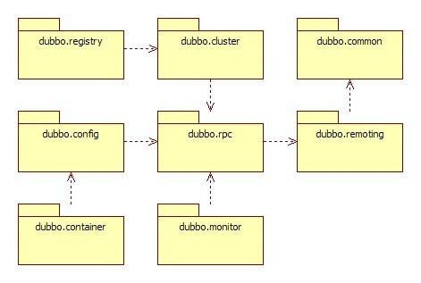

# dubbo 源码阅读笔记

## 源码项目依赖结构
源码项目依赖结构示意图

| 包名              | 功能                                                                                                |
|-----------------|---------------------------------------------------------------------------------------------------|
| dubbo-common    | 公共逻辑模块，提供工具类和通用模型                                                                                 |
| dubbo-config    | 配置模块：是 Dubbo 对外的 API，用户通过 Config 使用Dubbo，隐藏 Dubbo 所有细节                                            |
| dubbo-registry  | 注册中心模块：基于注册中心下发地址的集群方式，以及对各种注册中心的抽象                                                               |
| ※ dubbo-rpc     | 远程调用模块：抽象各种协议，以及动态代理，只包含一对一的调用，不关心集群的管理                                                           |
| ※ dubbo-cluster | 集群模块：将多个服务提供方伪装为一个提供方，包括：负载均衡, 集群容错，路由，分组聚合等。集群的地址列表可以是静态配置的，也可以是由注册中心下发                          |
| dubbo-remoting  | 网络通信模块，提供通用的客户端和服务端的通讯功能                                                                          |
| dubbo-container | 容器模块：是一个 Standlone 的容器，以简单的 Main 加载 Spring 启动，因为服务通常不需要 Tomcat/JBoss 等 Web 容器的特性，没必要用 Web 容器去加载服务 |
| dubbo-filter    | 过滤器模块：拦截调用链，实现各种功能的扩展，比如：监控，容错，日志，限流等                                                             |
| dubbo-plugin    | 插件模块：扩展 Dubbo 的功能，比如：监控，容错，日志，限流等                                                                 |
| hessian-lite    | Hessian 模块：Hessian 序列化，Hessian 2.0 序列化 Dubbo 对 Hessian 2 的 序列化 部分的精简、改进、BugFix                    |
