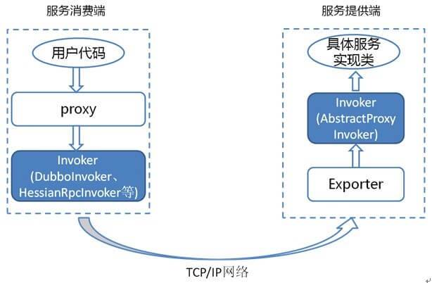

# dubbo 领域模型

## invoker
Invoker 是实体域，它是 Dubbo 的核心模型，其它模型都向它靠拢，或转换成它。 它代表一个可执行体，可向它发起 invoke 调用。

它有可能是一个本地的实现，也可能是一个远程的实现，也可能一个集群实现。

说明最重要的两种 Invoker：服务提供 Invoker 和服务消费 Invoker：



### code desc

服务消费者代码：
```java
public class DemoClientAction {

    private DemoService demoService;

    public void setDemoService(DemoService demoService) {
        this.demoService = demoService;
    }

    public void start() {
        String hello = demoService.sayHello("world" + i);
    }
}

```

DemoService 就是上图中服务消费端的 Proxy，用户代码通过这个 Proxy 调用其对应的 Invoker，而该 Invoker 实现了真正的远程服务调用。

服务提供者代码：

```java
public class DemoServiceImpl implements DemoService {

    public String sayHello(String name) throws RemoteException {
        return "Hello " + name;
    }
}
```

上面这个类会被封装成为一个 AbstractProxyInvoker 实例，并新生成一个 Exporter 实例。这样当网络通讯层收到一个请求后，会找到对应的 Exporter 实例，并调用它所对应的 AbstractProxyInvoker 实例，从而真正调用了服务提供者的代码。


## Invocation

Invocation 是会话域，它持有调用过程中的变量，比如方法名，参数等

| 方法                  | 描述                                   |
|---------------------|--------------------------------------|
| getMethodName()     | 获得方法名。                               |
| getParameterTypes() | 获得方法参数类型数组。                          |
| getArguments()      | 获得方法参数数组。                            |
| getAttachments() 等  | 获得隐式参数相关。 和 HTTP Request Header 有些相似 |
| getInvoker()        | 获得对应的 Invoker 对象。                    |

## Result
结果域，它持有调用过程中返回值，异常等

## Filter
org.apache.dubbo.rpc.Filter
过滤器接口，和我们平时理解的 javax.servlet.Filter 基本一致

## ProxyFactory
org.apache.dubbo.rpc.ProxyFactory ，代理工厂接口

## Protocol
com.apache.dubbo.rpc.Protocol

服务域，它是 Invoker 暴露和引用的主功能入口。 负责 Invoker 的生命周期管理。

Dubbo 处理服务暴露的关键就在 Invoker 转换到 Exporter 的过程。
下面我们以 Dubbo 和 RMI 这两种典型协议的实现来进行说明：

Dubbo 的实现
Dubbo 协议的 Invoker 转为 Exporter 发生在 DubboProtocol 类的 export 方法，它主要是打开 socket 侦听服务，并接收客户端发来的各种请求，通讯细节由 Dubbo 自己实现。

RMI 的实现
RMI 协议的 Invoker 转为 Exporter 发生在 RmiProtocol 类的 export 方法，它通过 Spring 或 Dubbo 或 JDK 来实现 RMI 服务，通讯细节这一块由 JDK 底层来实现，这就省了不少工作量。

## Exporter
com.apache.dubbo.rpc.Exporter

Invoker 暴露服务在 Protocol 上的对象

## InvokerListener
com.apache.dubbo.rpc.InvokerListener ，Invoker 监听器

## ExporterListener
com.apache.dubbo.rpc.ExporterListener ，Exporter 监听器

