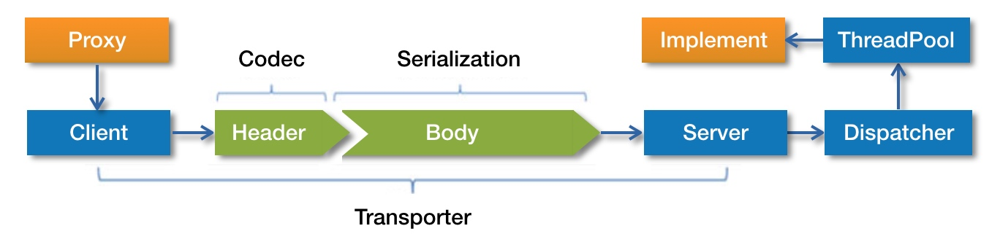
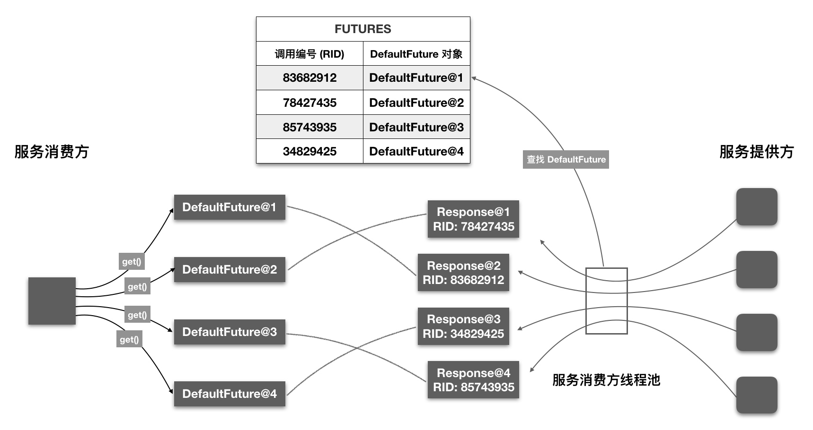

# 服务调用过程

Dubbo 服务调用过程比较复杂，包含众多步骤，比如发送请求、编解码、服务降级、过滤器链处理、序列化、线程派发以及响应请求等步骤



1. 服务消费者通过代理对象 Proxy 发起远程调用
2. 通过网络客户端 Client 将编码后的请求发送给服务提供方的网络层上，也就是 Server
3. Server 在收到请求后，首先要做的事情是对数据包进行解码
4. 然后将解码后的请求发送至分发器 Dispatcher
5. 分发器将请求派发到指定的线程池上
6. 线程池调用具体的服务

这就是一个远程调用请求的发送与接收过程。至于响应的发送与接收过程，这张图中没有表现出来

## 服务调用方式
Dubbo 支持同步和异步两种调用方式，Dubbo 默认使用同步调用方式。

异步调用还可细分为 **有返回值**  和 **无返回值** 。若要使用异步特性，需要服务消费方手动进行配置。

**无返回值** 异步调用是指服务消费方只管调用，但不关心调用结果，此时 Dubbo 会直接返回一个空的 RpcResult

代理类的逻辑比较简单。首先将运行时参数存储到数组中，然后调用 `InvocationHandler` 接口实现类的 `invoke` 方法，得到调用结果，最后将结果转型并返回给调用方

Dubbo 实现同步和异步调用比较关键的一点就在于由谁调用 `ResponseFuture` 的 get 方法。同步调用模式下，由框架自身调用 ResponseFuture 的 get 方法。异步调用模式下，则由用户调用该方法。

默认实现类 `DefaultFuture` 的 get 方法实现逻辑 :

当服务消费者还未接收到调用结果时，用户线程调用 get 方法会被阻塞住。同步调用模式下，框架获得 `DefaultFuture` 对象后，会立即调用 get 方法进行等待。而异步模式下则是将该对象封装到 `FutureAdapter` 实例中，并将 `FutureAdapter` 实例设置到 RpcContext 中，供用户使用。`FutureAdapter` 是一个适配器，用于将 Dubbo 中的 `ResponseFuture` 与 JDK 中的 `Future` 进行适配。这样当用户线程调用 `Future` 的 get 方法时，经过 FutureAdapter 适配，最终会调用 `ResponseFuture` 实现类对象的 get 方法，也就是 `DefaultFuture` 的 get 方法

## 服务消费方发送请求

以 DemoService 为例，展示 sayHello 方法的整个调用路径

```text
proxy0#sayHello(String)
  —> InvokerInvocationHandler#invoke(Object, Method, Object[])
    —> MockClusterInvoker#invoke(Invocation)
      —> AbstractClusterInvoker#invoke(Invocation)
        —> FailoverClusterInvoker#doInvoke(Invocation, List<Invoker<T>>, LoadBalance)
          —> Filter#invoke(Invoker, Invocation)  // 包含多个 Filter 调用
            —> ListenerInvokerWrapper#invoke(Invocation)
              —> AbstractInvoker#invoke(Invocation)
                —> DubboInvoker#doInvoke(Invocation)
                  —> ReferenceCountExchangeClient#request(Object, int)
                    —> HeaderExchangeClient#request(Object, int)
                      —> HeaderExchangeChannel#request(Object, int)
                        —> AbstractPeer#send(Object)
                          —> AbstractClient#send(Object, boolean)
                            —> NettyChannel#send(Object, boolean)
                              —> NioClientSocketChannel#write(Object)
```

### dubbo 数据包格式

消息头

| 偏移量(Bit)	 | 字段       | 	取值                                                                                                                                                                                                                 |
|-----------|----------|---------------------------------------------------------------------------------------------------------------------------------------------------------------------------------------------------------------------|
| 0 ~ 7	    | 魔数高位     | 	0xda00                                                                                                                                                                                                             |
| 8 ~ 15    | 	魔数低位    | 	0xbb                                                                                                                                                                                                               |
| 16        | 	数据包类型   | 	0 - Response, 1 - Request                                                                                                                                                                                          |
| 17	       | 调用方式     | 	仅在第16位被设为1的情况下有效，0 - 单向调用，1 - 双向调用                                                                                                                                                                                 |
| 18	       | 事件标识     | 	0 - 当前数据包是请求或响应包，1 - 当前数据包是心跳包                                                                                                                                                                                     |
| 19 ~ 23   | 	序列化器编号	 | 2 - Hessian2Serialization </br> 3 - JavaSerialization </br> 4 - CompactedJavaSerialization </br> 6 - FastJsonSerialization </br> 7 - NativeJavaSerialization </br> 8 - KryoSerialization </br> 9 - FstSerialization |
| 24 ~ 31   | 	状态      | 	20 - OK </br> 30 - CLIENT_TIMEOUT </br> 31 - SERVER_TIMEOUT </br> 40 - BAD_REQUEST </br> 50 - BAD_RESPONSE  </br>  ……                                                                                              |
| 32 ~ 95   | 	请求编号	   | 共8字节，运行时生成                                                                                                                                                                                                          |
| 96 ~ 127  | 	消息体长度   | 	运行时计算                                                                                                                                                                                                              |

编解码过程逻辑所在类 `ExchangeCodec`

## 服务提供方接收请求
### 请求解码
解码目的是最终得到一个具有完整调用信息的 `DecodeableRpcInvocation` 对象。
### 调用服务
解码器将数据包解析成 `Request` 对象后，`NettyHandler` 的 `messageReceived` 方法紧接着会收到这个对象，并将这个对象继续向下传递。这期间该对象会被依次传递给 `NettyServer`、`MultiMessageHandler`、`HeartbeatHandler` 以及 `AllChannelHandler`。最后由 `AllChannelHandler` 将该对象封装到 `Runnable` 实现类对象中，并将 `Runnable` 放入线程池中执行后续的调用逻辑。整个调用栈如下
```text
NettyHandler#messageReceived(ChannelHandlerContext, MessageEvent)
  —> AbstractPeer#received(Channel, Object)
    —> MultiMessageHandler#received(Channel, Object)
      —> HeartbeatHandler#received(Channel, Object)
        —> AllChannelHandler#received(Channel, Object)
          —> ExecutorService#execute(Runnable)    // 由线程池执行后续的调用逻辑
```

#### 线程派发模型
`Dispatcher` 真实的职责创建具有线程派发能力的 `ChannelHandler`，比如 AllChannelHandler、MessageOnlyChannelHandler 和 ExecutionChannelHandler 等，其本身并不具备线程派发能力
Dubbo 支持 5 种不同的线程派发策略

默认配置下，Dubbo 使用 `all` 派发策略


| 策略         | 用途                                      |
|------------|-----------------------------------------|
| all	       | 所有消息都派发到线程池，包括请求，响应，连接事件，断开事件等          |
| direct     | 	所有消息都不派发到线程池，全部在 IO 线程上直接执行            |
| message	   | 只有请求和响应消息派发到线程池，其它消息均在 IO 线程上执行         |
| execution	 | 只有请求消息派发到线程池，不含响应。其它消息均在 IO 线程上执行       |
| connection | 	在 IO 线程上，将连接断开事件放入队列，有序逐个执行，其它消息派发到线程池 |

#### 调用服务
从 `ChannelEventRunnable` 开始

`ChannelEventRunnable` 仅是一个中转站，它的 run 方法中并不包含具体的调用逻辑，仅用于将参数传给其他 `ChannelHandler` 对象进行处理，该对象类型为 `DecodeHandler`

`DecodeHandler` 主要是包含了一些解码逻辑。请求解码可在 IO 线程上执行，也可在线程池中执行，这个取决于运行时配置。`DecodeHandler` 存在的意义就是保证请求或响应对象可在线程池中被解码。解码完毕后，完全解码后的 `Request` 对象会继续向后传递，下一站是 `HeaderExchangeHandler`

对于双向通信，`HeaderExchangeHandler` 首先向后进行调用，得到调用结果。然后将调用结果封装到 `Response` 对象中，最后再将该对象返回给服务消费方。如果请求不合法，或者调用失败，则将错误信息封装到 `Response` 对象中，并返回给服务消费方。

#### 服务调用过程
```text
ChannelEventRunnable#run()
  —> DecodeHandler#received(Channel, Object)
    —> HeaderExchangeHandler#received(Channel, Object)
      —> HeaderExchangeHandler#handleRequest(ExchangeChannel, Request)
        —> DubboProtocol.requestHandler#reply(ExchangeChannel, Object)
          —> Filter#invoke(Invoker, Invocation)
            —> AbstractProxyInvoker#invoke(Invocation)
              —> Wrapper0#invokeMethod(Object, String, Class[], Object[])
                —> DemoServiceImpl#sayHello(String)
```
## 服务提供方返回调用结果
Response 对象编码的过程和 Request 对象编码过程相似
## 服务消费方接收调用结果
服务消费方在收到响应数据后，首先要做的事情是对响应数据进行解码，得到 `Response` 对象。然后再将该对象传递给下一个入站处理器，这个入站处理器就是 `NettyHandler`

接下来 `NettyHandler` 会将这个对象继续向下传递，最后 `AllChannelHandler` 的 `received` 方法会收到这个对象，并将这个对象派发到线程池中

这个过程和服务提供方接收请求的过程一样

### 向用户线程传递调用结果
响应数据解码完成后，Dubbo 会将响应对象派发到线程池上。要注意的是，线程池中的线程并非用户的调用线程，所以要想办法将响应对象从线程池线程传递到用户线程上

用户线程在发送完请求后的动作，即调用 DefaultFuture 的 get 方法等待响应对象的到来。当响应对象到来后，用户线程会被唤醒，并通过 **调用编号** 获取属于自己的响应对象

#### 调用编号很重要

一般情况下，服务消费方会并发调用多个服务，每个用户线程发送请求后，会调用不同 `DefaultFuture` 对象的 get 方法进行等待。 一段时间后，服务消费方的线程池会收到多个响应对象。这个时候要考虑一个问题，如何将每个响应对象传递给相应的 `DefaultFuture` 对象，且不出错。答案是通过调用编号。`DefaultFuture` 被创建时，会要求传入一个 `Request` 对象。此时 `DefaultFuture` 可从 Request 对象中获取调用编号，并将 `<调用编号, DefaultFuture 对象>` 映射关系存入到静态 Map 中，即 `FUTURES`。线程池中的线程在收到 `Response` 对象后，会根据 `Response` 对象中的调用编号到 `FUTURES` 集合中取出相应的 `DefaultFuture` 对象，然后再将 `Response` 对象设置到 `DefaultFuture` 对象中。最后再唤醒用户线程，这样用户线程即可从 `DefaultFuture` 对象中获取调用结果了。整个过程大致如下图：


