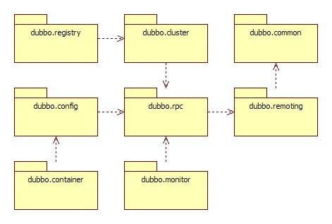
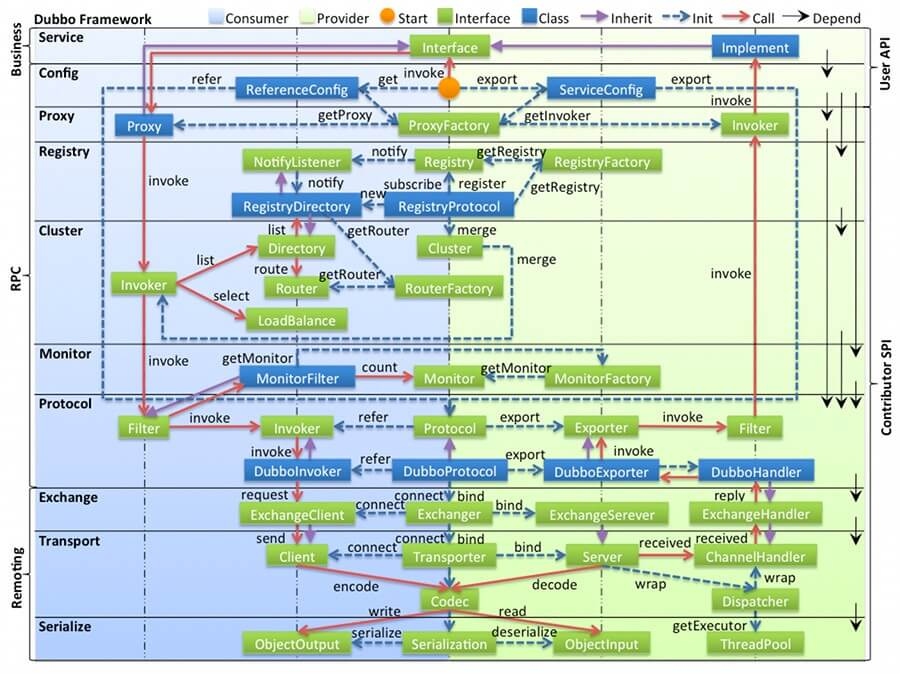
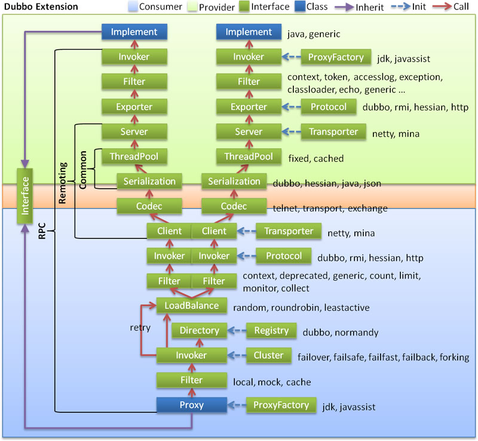

# dubbo 源码阅读笔记

## 源码项目依赖结构
源码项目依赖结构示意图

| 包名              | 功能                                                                                                |
|-----------------|---------------------------------------------------------------------------------------------------|
| dubbo-common    | 公共逻辑模块，提供工具类和通用模型                                                                                 |
| dubbo-config    | 配置模块：是 Dubbo 对外的 API，用户通过 Config 使用Dubbo，隐藏 Dubbo 所有细节                                            |
| dubbo-registry  | 注册中心模块：基于注册中心下发地址的集群方式，以及对各种注册中心的抽象                                                               |
| ※ dubbo-rpc     | 远程调用模块：抽象各种协议，以及动态代理，只包含一对一的调用，不关心集群的管理                                                           |
| ※ dubbo-cluster | 集群模块：将多个服务提供方伪装为一个提供方，包括：负载均衡, 集群容错，路由，分组聚合等。集群的地址列表可以是静态配置的，也可以是由注册中心下发                          |
| dubbo-remoting  | 网络通信模块，提供通用的客户端和服务端的通讯功能                                                                          |
| dubbo-container | 容器模块：是一个 Standlone 的容器，以简单的 Main 加载 Spring 启动，因为服务通常不需要 Tomcat/JBoss 等 Web 容器的特性，没必要用 Web 容器去加载服务 |
| dubbo-filter    | 过滤器模块：拦截调用链，实现各种功能的扩展，比如：监控，容错，日志，限流等                                                             |
| dubbo-plugin    | 插件模块：扩展 Dubbo 的功能，比如：监控，容错，日志，限流等                                                                 |
| hessian-lite    | Hessian 模块：Hessian 序列化，Hessian 2.0 序列化 Dubbo 对 Hessian 2 的 序列化 部分的精简、改进、BugFix                    |

## 模块层次
模块层次说明图

==================== Business ====================

| 层次          | 说明         |
|-------------|------------|
| Service 业务层 | 业务代码的接口与实现 |

==================== RPC ====================

| 层次             | 说明                                                                                                                                                                               |
|----------------|----------------------------------------------------------------------------------------------------------------------------------------------------------------------------------|
| config 配置层     | 对外配置接口，以 ServiceConfig, ReferenceConfig 为中心，可以直接初始化配置类，也可以通过 Spring 解析配置生成配置类    模块实现 [ dubbo-config ]                                                                       |
| proxy 服务代理层    | 服务接口透明代理，生成服务的客户端 Stub 和服务器端 Skeleton, 以 ServiceProxy 为中心，扩展接口为 ProxyFactory  com.alibaba.dubbo.rpc.proxy包 + com.alibaba.dubbo.rpc.ProxyFactory接口   模块实现 [dubbo-rpc-rpc] |
| registry 注册中心层 | 封装服务地址的注册与发现，以服务 URL 为中心，扩展接口为 RegistryFactory, Registry, RegistryService   模块实现[ dubbo-registry ]                                                                           |
| cluster 路由层    | 封装多个提供者的路由及负载均衡，并桥接注册中心，以 Invoker 为中心，扩展接口为 Cluster, Directory, Router, LoadBalance   模块实现 [dubbo-cluster ]                                                                  |
| monitor 监控层    | RPC 调用次数和调用时间监控，以 Statistics 为中心，扩展接口为 MonitorFactory, Monitor, MonitorService  模块实现 [ dubbo-monitor ]                                                                       |
==================== Remoting ====================

| 层次               | 说明                                                                                                                                                                                                     |
|------------------|--------------------------------------------------------------------------------------------------------------------------------------------------------------------------------------------------------|
| protocol 远程调用层   | 封将 RPC 调用，以 Invocation, Result 为中心，扩展接口为 Protocol, Invoker, Exporter   com.alibaba.dubbo.rpc.protocol包 + com.alibaba.dubbo.rpc.Protocol接口   模块实现[ dubbo-rpc-rpc ]                              |
| exchange 信息交换层   | 封装请求响应模式，同步转异步，以 Request, Response 为中心，扩展接口为 Exchanger, ExchangeChannel, ExchangeClient, ExchangeServer   com.alibaba.dubbo.remoting.exchange包              模块定义接口[ dubbo-remoting-api ]   |
| transport 网络传输层  | 抽象 mina 和 netty 为统一接口，以 Message 为中心，扩展接口为 Channel, Transporter, Client, Server, Codec com.alibaba.dubbo.remoting.transport包 模块定义接口[ dubbo-remoting-api ]                                   |
| serialize 数据序列化层 | 可复用的一些工具，扩展接口为 Serialization, ObjectInput, ObjectOutput, ThreadPool com.alibaba.dubbo.common.serialize包 模块实现[ dubbo-common ]                                                               |
### 关系说明

在 RPC 中，Protocol 是核心层，也就是只要有 Protocol + Invoker + Exporter 就可以完成非透明的 RPC 调用，然后在 Invoker 的主过程上 Filter 拦截点

Consumer 和 Provider 是抽象概念，只是想让看图者更直观的了解哪些类分属于客户端与服务器端，不用 Client 和 Server 的原因是 Dubbo 在很多场景下都使用 Provider, Consumer, Registry, Monitor 划分逻辑拓扑节点，保持统一概念

Cluster 是外围概念，所以 Cluster 的目的是将多个 Invoker 伪装成一个 Invoker，这样其它人只要关注 Protocol 层 Invoker 即可，加上 Cluster 或者去掉 Cluster 对其它层都不会造成影响，因为只有一个提供者时，是不需要 Cluster 的

Proxy 层封装了所有接口的透明化代理，而在其它层都以 Invoker 为中心，只有到了暴露给用户使用时，才用 Proxy 将 Invoker 转成接口，或将接口实现转成 Invoker，也就是去掉 Proxy 层 RPC 是可以 Run 的，只是不那么透明，不那么看起来像调本地服务一样调远程服务。 Proxy 会拦截 `service.doSomething(args)` 的调用，转发给该 Service 对应的 Invoker ，从而实现透明化的代理

Remoting 实现是 Dubbo 协议的实现，如果你选择 RMI 协议，整个 Remoting 都不会用上。Remoting 内部再划为 Transport 传输层和 Exchange 信息交换层，Transport 层只负责单向消息传输，是对 Mina, Netty, Grizzly 的抽象，它也可以扩展 UDP 传输；而 Exchange 层是在传输层之上封装了 Request-Response 语义。
Registry 和 Monitor 实际上不算一层，而是一个独立的节点，只是为了全局概览，用层的方式画在一起。

## dubbo 核心流程 - 调用链说明

[dubbo 官方文档中的架构描述](https://cn.dubbo.apache.org/zh-cn/overview/mannual/java-sdk/reference-manual/architecture/code-architecture/ "代码架构")

垂直分层如下：
- 下方 淡蓝背景( Consumer )：服务消费方使用的接口
- 上方 淡绿色背景( Provider )：服务提供方使用的接口
- 中间 粉色背景( Remoting )：通信部分的接口
- 自 LoadBalance 向上，每一行分成了多个相同的 Interface ，指的是负载均衡后，向 Provider 发起调用。
- 左边 括号 部分，代表了垂直部分更细化的分层，依次是：Common、Remoting、RPC、Interface 。
- 右边 蓝色虚线( Init ) 为初始化过程，通过对应的组件进行初始化。例如，ProxyFactory 初始化出 Proxy 。

